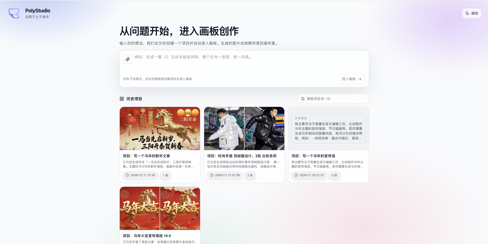
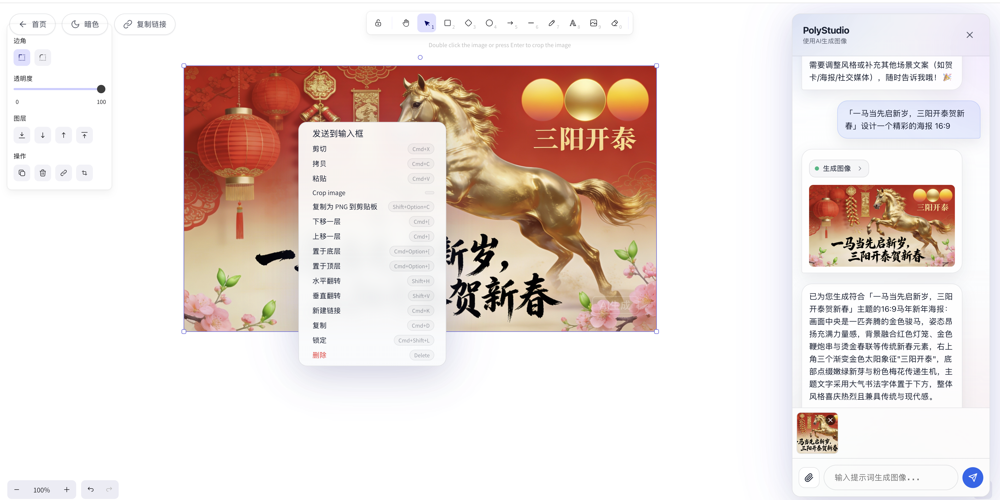

# PolyStudio

一个「对话式生图/改图 + 可视化画板」项目：FastAPI 后端通过 LangGraph 编排工具调用，React 前端提供画板承载与项目管理，支持 SSE 流式输出、图片自动落到画板、项目链接与历史记录。

> 仓库总览与其他子项目导航见根目录：`README.md`

## 功能概览

- **对话式生成/编辑图片**：支持 `generate_image` / `edit_image`
- **SSE 流式输出**：逐步展示工具调用与结果
- **可视化画板**：生成的图片自动插入画布，支持缩放、对齐、框选等操作
- **项目管理**：项目列表、重命名、复制链接、删除
- **主题切换**：支持深色/亮色主题切换
- **本地持久化**：
  - 图片保存到 `backend/storage/images/`
  - 项目与聊天记录保存到 `backend/storage/chat_history.json`

## 界面预览

### 首页


### 画板编辑页


### 目录结构

```
PolyStudio/
├── backend/                 # FastAPI 后端
│   ├── app/                 # 业务代码
│   ├── requirements.txt     # Python 依赖（以此为准）
│   ├── start.sh             # 推荐的后端启动脚本（确保用正确的 Python 环境）
│   ├── scripts/             # 维护脚本（如存量图片归一化）
│   └── storage/             # 运行数据（项目历史、生成图片）
├── frontend/                # React + Vite 前端
│   ├── src/components/      # 聊天界面、画板组件、首页组件
│   └── vite.config.ts       # /api、/storage 代理
├── assets/                  # 项目截图
└── CONFIG.md                # 配置说明（环境变量等）
```

### 快速开始

#### 环境要求

- **Python**：3.9+
- **Node.js**：18+

#### 后端启动（FastAPI）

0) （推荐）创建并进入 conda 环境：

```bash
conda create -n agentImage python=3.11 -y
conda activate agentImage
```

> 注意：`backend/start.sh` 默认会 `conda activate agentImage`。如果你用别的环境名，请同步修改该脚本里的环境名。

1) 安装依赖：

```bash
cd backend
pip install -r requirements.txt
```

2) 配置环境变量（可选）：在 `backend/.env` 写入（详见 `CONFIG.md`）

推荐方式：

```bash
cd backend
cp env.example .env
```

3) 启动后端（推荐）：

```bash
cd backend
chmod +x start.sh
./start.sh
```

或直接：

```bash
cd backend
python -m uvicorn app.main:app --reload --host 0.0.0.0 --port 8000
```

后端默认地址：`http://localhost:8000`

#### 前端启动（Vite）

```bash
cd frontend
npm install
npm run dev
```

前端默认地址：`http://localhost:3000`

`frontend/vite.config.ts` 已配置代理：
- `/api` -> `http://localhost:8000`
- `/storage` -> `http://localhost:8000`

### API（SSE）

#### POST `/api/chat`

请求体：

```json
{
  "message": "生成一张赛博朋克城市夜景",
  "messages": [],
  "session_id": "optional-session-id"
}
```

响应（SSE）示例：

```
data: {"type":"delta","content":"..."}
data: {"type":"tool_call","id":"...","name":"generate_image","arguments":{...}}
data: {"type":"tool_result","tool_call_id":"...","content":"{...image_url...}"}
data: [DONE]
```

### 技术栈/服务说明（以代码为准）

- **LLM（对话模型）**：通过 `OPENAI_BASE_URL` 指向 OpenAI 兼容接口（默认 SiliconFlow），模型名由 `MODEL_NAME` 指定
- **图像生成/编辑**：后端 `generate_image` / `edit_image` 工具调用 SiliconFlow 的图片接口（并将结果下载保存到本地 `/storage/images`）
- **颜色一致性**：后端保存图片时会尝试做 sRGB 归一化（依赖 `Pillow`，已在 `requirements.txt` 固定）

### 常见问题（简版）

- **建议不要手动混装 langchain 版本**：以 `backend/requirements.txt` 为准安装，避免出现导入错误/版本不兼容。

